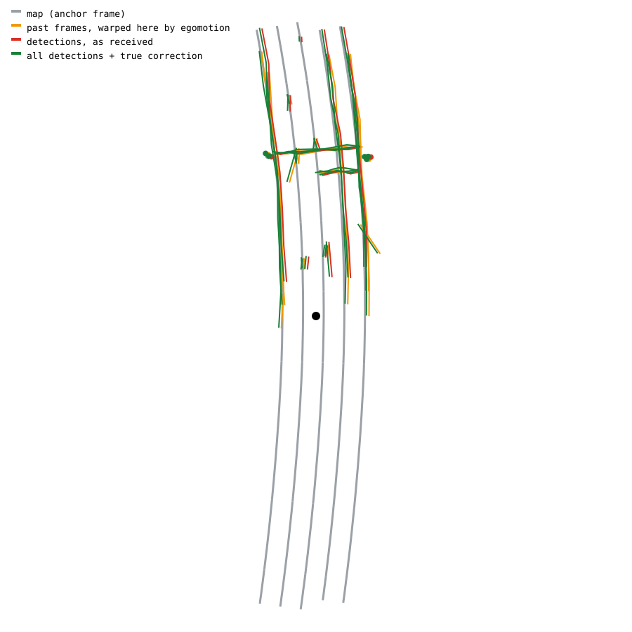
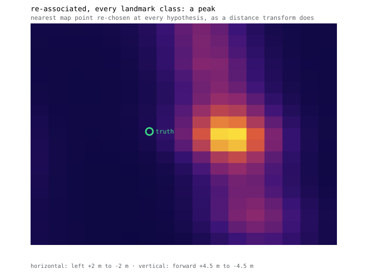
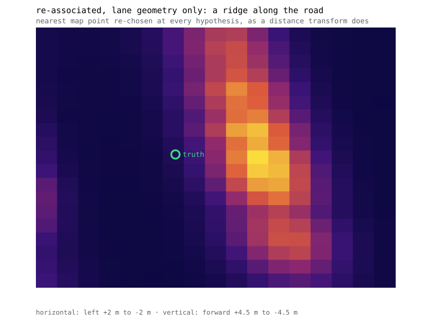

# map-pose-former

**Where is the car, given what the camera sees and what the map says?** — again,
but learned this time.

A readable PyTorch implementation of transformer map-matching localization:
match detected landmarks against an HD map, solve the rigid transform in closed
form, report a pose correction with a measured covariance. Then prune it, distil
it, quantize it, and put it on TensorRT.

The learned counterpart to
[camera-map-localization](https://github.com/yanghuafang/camera-map-localization),
which answers the same question by searching a grid of pose hypotheses. Same
input contract, same frame conventions, same error metrics, so the two backends
are comparable frame for frame.

Written to be **read**. Every non-obvious decision carries its reason, and where
the code falls short of its own documentation it says so —
[OPEN_ITEMS.md](docs/OPEN_ITEMS.md).

## Three commands

```bash
./scripts/setup.sh        # conda env + CPU torch
./scripts/ci.sh           # format, lint, tests
./scripts/run_smoke.sh    # train, evaluate, and draw a frame
```

No dataset, no GPU: the scenes are generated locally. CUDA training and the
TensorRT export need Linux; everything else runs on macOS too, which is why
`scripts/remote-ubuntu.sh` exists — edit on a laptop, run on the box.

## What it does, per frame

```
    map ──────────┐
                  ├─ tokenize ─ attend ─ assignment ─┬─ Procrustes ── delta
    detections ───┘                                  │
      this frame, and the last two                   └─ the same cost,
      warped here by egomotion                          on a grid ──── cov, trust
```



Grey is the map, cropped around the drifted prior. Red is what the camera
reports this frame. Orange is the previous two frames warped here by odometry —
that it lands on top of the red is the temporal path checking its own
arithmetic. Green is everything after the true correction, sitting on the map.
Short red stripes are dashed lane paint, which the map stores as an attribute
and the detector sees as geometry.

No world coordinate reaches the network, so it cannot memorise a city instead of
learning to match. Output is `(delta, covariance, trust)` — what the classical
repo's `LocalizationKF::Update` already consumes.

## The picture that explains the problem

Same frame, same oracle matching, different evidence:

| every landmark class | lane geometry only |
|---|---|
|  |  |
| a peak: position is determined | a **ridge** along the road: sliding forward costs almost nothing |

Lane lines run parallel to travel, so a hypothesis that has slid a metre down
the road still lies on the same lines. Poles, signs and stop lines pin
along-track position; removing them flattens the surface 31% along track while
lateral and heading barely move.

**The model does not report that surface** — it reports the cheaper one, which
is a paraboloid with no ridge. Finding that out is what the tool was built for.
`--mode fit` draws it; [RESULTS.md](docs/RESULTS.md) has the measurement.

## Three ideas worth taking

**Solve the geometry, learn the correspondence.** Once the model has said which
detected point is which map point, the transform is determined — so the pose
head is closed-form weighted Procrustes with no parameters, and all capacity
goes to matching.

That once carried an accuracy claim it could not support: against a plain
regression baseline the first version **lost seven to one out of distribution**,
because a rigid fit over confident wrong matches is unbounded and a `tanh` is
not. The claim was retracted in place rather than edited away. The head is now a
robust estimator, and the rematch split the difference: it wins heading by a
factor of two and still loses translation.

**Compute the cost surface, do not predict it.** An MLP trained to draw cost
surfaces produces ridges that look right without evidence behind them. The
assignment-weighted error over all 4199 hypotheses is a closed form in eleven
statistics the Procrustes solve already computes — a few 2 × 2 matmuls, and
1.1 M parameters deleted. The two output paths become one objective read twice.

**What accumulates is evidence about the pose *error*, not about a pose.** That
is what lets a past detection reach this frame through measured egomotion alone,
before the correction is known; [ARCHITECTURE.md](docs/ARCHITECTURE.md) has the
algebra. Fusion is more tokens, warped, with an age embedding. Static shapes
survive, which TensorRT needs.

## What is real, and what is not

- **The data is generated.** KITTI ships no HD map, and synthesizing one from
  ground truth makes the map a function of the pose being predicted. Procedural
  scenes buy a known answer and controllable evidence. nuScenes is
  [M2](docs/ROADMAP.md).
- **Perception is an input.** No detector is trained. On generated data
  detections come from the map with an error model; on nuScenes they will come
  from a pretrained online mapper run offline.
- **Open loop only.** The prior is drawn from a distribution, not produced by
  the previous frame.

Full list: [OPEN_ITEMS.md](docs/OPEN_ITEMS.md).

## Experiments

One checkpoint, less evidence — only the last needs its own training run:

```bash
tools/eval.py runs/base/best.pt --split test                                    # baseline
tools/eval.py runs/base/best.pt --split test 'data.sample.keep_classes=[0,1]'   # observability
tools/eval.py runs/base/best.pt --split test data.sample.stripe_dashed=false    # the dashes
tools/eval.py runs/base/best.pt --split test model.refine_iters=1               # refinement
tools/eval.py runs/base/best.pt --split test model.irls_iters=0                 # robustness
tools/train.py --config configs/ablate_no_history.yaml                          # temporal
```

The third is the one a public dataset cannot run cheaply. A dashed lane line is
paint with ends, and a stripe end is along-track evidence in a class otherwise
blind to it — but real vector maps store one continuous polyline plus a
`mark_type` attribute, discarding the ends. Here the map does exactly that and
the detector sees the stripes, so the question becomes a switch.

## Numbers

Test split, 8 880 frames, seeds disjoint from training. One RTX A6000, 37 000
steps.

| | trans | long | lat | yaw | recall @ 0.25 m, 0.5° |
|---|---|---|---|---|---|
| do nothing (the prior) | 1.611 | 1.497 | 0.596 | 0.993° | 1.3% |
| all frames | **0.308** | 0.293 | 0.095 | 0.211° | **96.0%** |
| *the architecture this replaced* | *0.521* | *0.498* | *0.154* | *0.590°* | *86.0%* |

A 5.2× reduction on translation, 41% better than the model it replaced.

**And 0.44% of frames are confidently wrong.** The median frame is calibrated
and the tail-excluded ANEES is 1.03, but 39 frames of 8 880 have a covariance
that is catastrophically too small. The next milestone hands `(delta, cov,
trust)` to a Kalman filter, and those are the frames that would break it — so
the open problem is detecting them, not rescaling everything.
[RESULTS.md](docs/RESULTS.md) has what separates them.

Three ablations worth the space, all one checkpoint under less evidence:

| | trans | long |
|---|---|---|
| everything | **0.308** | 0.293 |
| **nuScenes' classes** — no poles or signs | 1.074 | 1.069 |
| lane geometry only | 1.408 | 1.405 |
| no dashed stripe geometry | 0.351 | 0.340 |

Lane geometry recovers essentially nothing along track (1.405 against a 1.497
prior) while recovering 83% laterally. The dashes carry 16% of the longitudinal
signal — the experiment a public dataset cannot run cheaply, and it worked.

## Tools

| Command | Purpose |
|---|---|
| `tools/train.py` | Train. `--config` plus `section.field=value` overrides |
| `tools/eval.py` | Evaluate a checkpoint, with the do-nothing baseline alongside |
| `tools/viz_sample.py` | Draw one frame: map, detections, warped history, both corrections |
| `tools/viz_volume.py` | Draw the cost surface, in either of the two senses it has |
| `tools/bench.py` | Where the step time goes — generator, loader and model, apart |

| Script | Purpose |
|---|---|
| `scripts/setup.sh` | conda env and torch, `--cuda` for the training box |
| `scripts/ci.sh` | Format, lint, tests; `--smoke` adds the end-to-end run |
| `scripts/run_smoke.sh` | Train, evaluate and visualise in minutes, on CPU |
| `scripts/docs.sh` | Doxygen API reference from the docstrings |
| `scripts/remote-ubuntu.sh` | Mirror this tree to the Ubuntu box and run there |
| `scripts/download_*.sh` | nuScenes and Argoverse 2, resumable |

## Layout

```
mapposeformer/      The library. Start at model/model.py
  data/             Procedural worlds, the sample contract, the dataset
  model/            Tokenizer, attention, matcher, pose head, volume head
  engine/           The training loop and the evaluator
configs/            YAML overriding the dataclass defaults
tools/              Command-line entry points
tests/              Geometry, data invariants, model numerics
docs/               Start at docs/README.md
```

## License

MIT — see [LICENSE](LICENSE).
